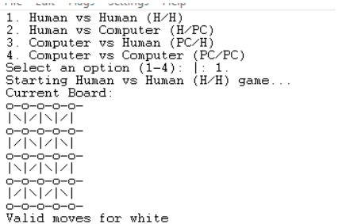
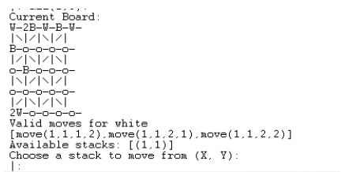

## Game Overview
[**Sight**](https://kanare-abstract.com/en/pages/sight) is an abstract strategy board game where players strategically place and move their pieces across a 5x5 board. The goal is to control the board by stacking pieces through the "line of sight" mechanism. The game concludes when one player cannot make a legal move, and the opponent is declared the winner.

### Rules of the Game
1. The board consists of 5x5 intersections.
2. Players take turns placing or moving their pieces.
3. A piece can be placed on any empty intersection or moved from a stack under the player's control.
4. Pieces in the line of sight of a new piece or move will stack with the newly placed piece if they belong to the same player.
5. The game ends when a player has no legal move.

Oficial Rules and game webpage can be seen here [Sight](https://kanare-abstract.com/en/pages/sight)

## Game States

**Initial State**



**Mid Game State**



## Installation and Execution
This implementation is compatible with SICStus Prolog version 4.9 and works on both Linux and Windows. Follow these steps to set up and run the game:

### Prerequisites
- SICStus Prolog 4.9

### Installation
1. Download and install SICStus Prolog from [SICStus Official Website](https://sicstus.sics.se/).
2. Ensure SICStus Prolog is correctly configured in your system's PATH.
3. Extract the game files into a directory. The folder structure should be as follows:
   ```
   PFL_TP2_TXX_Sight_#GROUP
   └── game.pl
   ```

### Execution
1. Open a terminal or command prompt.
3. Start SICStus Prolog by typing `sicstus`.
4. Load the main file with:
   ```prolog
   ?- consult('game.pl').
   ```
5. Start the game by executing:
   ```prolog
   ?- play.
   ```

## Game Logic and Design

### Bot as a Player Logic

2. **Bot Difficulty:**
   - **Easy Mode (Random Moves):**
     The computer randomly selects a move from the list of valid moves. This is done using the `choose_random_move` predicate, which picks a random move from the list of available moves.
   
   - **Medium Mode (Best-Rated Moves):**
     The computer uses a greedy algorithm that evaluates each possible move based on a value function. The `evaluate_moves` predicate calculates the value for each valid move. The best move is selected by the highest value, and the move is executed. The `choose_best_move` predicate handles this logic by selecting the move with the highest value.

3. **Evaluating Moves (Medium Difficulty):**
   - The evaluation of moves in medium difficulty is based on a heuristic value function. The value for each move is calculated using the `value` predicate (not shown in the code, but assumed to evaluate the board state after a move).
   - The `evaluate_moves` predicate generates a list of moves with their corresponding values. The `choose_best_move` predicate selects the move with the highest value and executes it.

4. **Move Execution:**
   - Once a move is selected (either randomly or based on evaluation), it is executed using the `move` predicate. This predicate updates the board by either adding a new piece or moving a piece on the board.
   - The game state is updated accordingly, and the turn switches to the next player.

### Game Configuration Representation
The game configuration includes player types (human or computer) and AI difficulty levels. It is represented using the following term:
```prolog
game_config(PlayerType, NextPlayerType).
```
- `PlayerType`: Specifies whether the player is human or an AI (e.g., `human`, `computer(Difficulty)`).
- `NextPlayerType`: Specifies the type for the subsequent player.

### Internal Game State Representation
The game state includes the board's current configuration and the active player. It is represented as:
```prolog
game_state(Board, Player).
```
- `Board`: A 5x5 list of lists representing the intersections. Each cell contains a stack of pieces or an empty list (e.g., `[[[], [], [white], [], []], ...]`).
- `Player`: The current player (`white` or `black`).

### Move Representation
Moves are represented as:
- `add(X, Y)`: Adding a piece at coordinates `(X, Y)`.
- `move(X1, Y1, X2, Y2)`: Moving a piece from `(X1, Y1)` to `(X2, Y2)`.

### Key Predicates
- **`play/0`**: Launches the game menu and starts the game.
- **`initial_state(+GameConfig, -GameState)`**: Sets up the initial game state based on the configuration.
- **`display_game(+GameState)`**: Displays the current state of the board.
- **`move(+GameState, +Move, -NewGameState)`**: Executes a move and updates the game state.
- **`valid_moves(+GameState, -ListOfMoves)`**: Generates all valid moves for the current player.
- **`game_over(+GameState, -Winner)`**: Determines if the game has ended and identifies the winner.
- **`choose_move(+GameState, +Level, -Move)`**: Selects a move for the computer player based on the AI difficulty level.

### User Interaction
- A text-based menu allows players to configure the game type (e.g., H/H, H/PC, PC/PC).
- During gameplay, human players input moves directly. The program validates these inputs and prompts the player until a valid move is entered.
- Computer players select moves automatically based on their difficulty level.

## Considerations for Game Extensions
- **Variable-Sized Boards**: The implementation can be extended to support larger or smaller boards by modifying the board initialization and validation logic.
- **Optional Rules**: Simplified rules for beginner players or additional expert-level mechanics can be added as conditional checks in the move validation predicates.
- **AI Enhancements**: A third difficulty level using the minimax algorithm could be implemented for more strategic computer play.

## Conclusions
This project demonstrates the implementation of a board game using Prolog, emphasizing declarative programming principles. The game logic and user interface are designed to provide an engaging experience while showcasing Prolog's capabilities for logic-based reasoning.

### Known Issues
- The current AI does not predict opponent moves beyond the immediate turn.
- Limited scalability to non-square boards without modifications.

### Future Improvements
- Implementing a minimax-based AI for advanced gameplay.
- Adding support for custom board sizes and optional rules.
- Enhancing the user interface with additional visual feedback.

## Bibliography
- [Official SICStus Prolog Documentation](https://sicstus.sics.se/sicstus/docs/latest4/html/sicstus.html)
- [Sight Rules](https://kanare-abstract.com/en/pages/sight)
- [Coding Guidelines for Prolog](https://arxiv.org/pdf/0911.2899)

---
Thank you for reviewing our implementation. We hope you enjoy the game "Sight"!
